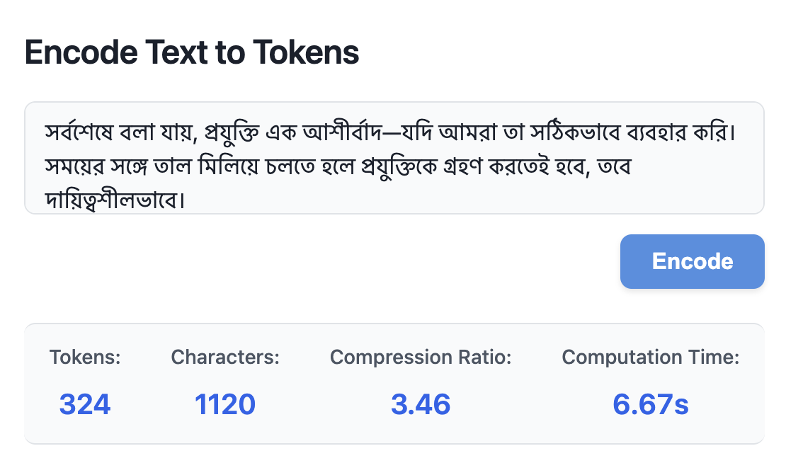
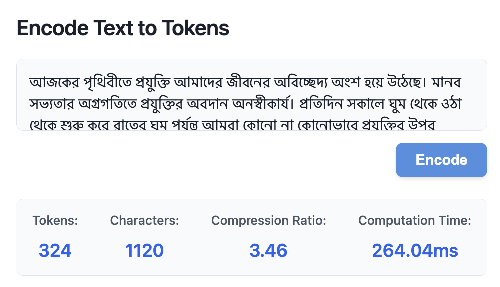

# 🔠 Polyglot

Polyglot is a high-performance multilingual tokenizer, built entirely from scratch in Go, that efficiently compresses text from 10 diverse languages using the Byte-Pair Encoding (BPE) algorithm. The system supports English, Hebrew, Bengali, Vietnamese, Korean, Arabic, Russian, Thai, Chinese, and Japanese.

## 📊 Metrics

- **Compression Ratio:** 3.0
- **Vocabulary Size:** 40,146
- **Total Training Corpus:** 432,584,912 characters (10M sentences)

## 📈 Benchmarking

Polyglot is evaluated against five SOTA tokenizers: Tiktoken, Transformers, SentencePiece, mBERT, and XLM. A total of 100,000 unseen sentences—10,000 per language across 10 languages—were sampled from the [statmt/cc10](https://huggingface.co/datasets/statmt/cc100?p=1) dataset. For each tokenizer and language, the mean compression ratio and token fertility were computed over the corresponding 10,000 sentences.

### 🔄 Compression Ratio

| Language | polyglot | mbert  | sentencepiece | tiktoken | transformers | xlm  |
|----------|----------|--------|---------------|----------|--------------|------|
| ar       | 2.61     | 2.43   | 2.76          | 3.03     | 1.00         | 3.03 |
| bn       | 2.80     | 2.07   | 2.84          | 2.56     | 0.52         | 2.83 |
| en       | 3.75     | 3.77   | 3.90          | 4.43     | 4.21         | 3.77 |
| he       | 2.32     | 2.29   | 2.51          | 2.54     | 0.88         | 2.80 |
| ja       | 1.51     | 1.25   | 11.80         | 1.35     | 0.72         | 1.78 |
| ko       | 1.51     | 1.48   | 1.93          | 1.62     | 0.50         | 1.78 |
| ru       | 3.36     | 3.17   | 1.37          | 3.72     | 0.94         | 3.85 |
| th       | 2.49     | 1.45   | 6.49          | 2.30     | 0.55         | 3.22 |
| vi       | 2.86     | 3.13   | 1.26          | 3.20     | 1.14         | 3.42 |
| zh       | 1.36     | 1.04   | 5.40          | 1.32     | 0.50         | 1.51 |

#### Compression Ratio Rankings

| Rank |    Tokenizer   |  Average Compression Ratio  |
|:----:|:--------------:|:---------------------------:|
|  1   | sentencepiece  |          **4.03**           |
|  2   |      xlm       |          **2.80**           |
|  3   |    tiktoken    |          **2.61**           |
|  4   |    polyglot    |          **2.46**           |
|  5   |      mbert     |          **2.21**           |
|  6   |  transformers  |          **1.10**           |

### 🧩 Token Fertility

| Language | polyglot | mbert | sentencepiece | tiktoken | transformers | xlm  |
|----------|----------|--------|--------------|----------|--------------|------|
| ar       | 1.96     | 2.10  | 1.85          | 1.69     | 5.10         | 1.68 |
| bn       | 1.84     | 2.50  | 1.82          | 2.02     | 10.01        | 1.82 |
| en       | 1.19     | 1.19  | 1.15          | 1.01     | 1.06         | 1.19 |
| he       | 2.08     | 2.10  | 1.92          | 1.90     | 5.46         | 1.72 |
| ja       | 1.12     | 1.35  | 0.14          | 1.25     | 2.35         | 0.95 |
| ko       | 1.91     | 1.95  | 1.50          | 1.79     | 5.73         | 1.63 |
| ru       | 1.62     | 1.72  | 3.97          | 1.46     | 5.82         | 1.42 |
| th       | 1.76     | 3.02  | 0.67          | 1.90     | 7.96         | 1.36 |
| vi       | 1.65     | 1.50  | 3.74          | 1.47     | 4.13         | 1.37 |
| zh       | 1.21     | 1.58  | 0.30          | 1.25     | 3.31         | 1.09 |

#### Token Fertility Rankings

| Rank |    Tokenizer   |  Average Token Fertility   |
|:----:|:--------------:|:--------------------------:|
|  1   |  transformers  |          **5.09**          |
|  2   |      mbert     |          **1.90**          |
|  3   | sentencepiece  |          **1.71**          |
|  4   |    polyglot    |          **1.63**          |
|  5   |    tiktoken    |          **1.57**          |
|  6   |      xlm       |          **1.42**          |

### 🌍 📊 Cross-Lingual Consistency

A primary goal of Polyglot is to achieve uniform tokenization quality across diverse languages. The following table compares how consistently each tokenizer performs across all 10 evaluated languages.

| Tokenizer     | Compression Ratio σ    | Token Fertility σ    | Total σ                     |
|---------------|------------------------|----------------------|-----------------------------|
| xlm           | 0.80                   | 0.27                 | 1.07                        |
| polyglot      | 0.76                   | 0.33                 | 1.09                        |
| tiktoken      | 0.97                   | 0.32                 | 1.29                        |
| mbert         | 0.88                   | 0.53                 | 1.41                        |
| transformers  | 1.06                   | 2.48                 | 3.54                        |

## 🏋️ Training

- **Dataset:** The tokenizer was trained on 10M sentences from the [opus-100 dataset](https://huggingface.co/datasets/Helsinki-NLP/opus-100), with 1M sentences per language. The language set was carefully selected to incorporate a sufficiently diverse range of scripts in our training dataset.
- **Training Process:** The current version has a compression ratio of 3.0. Training runs are in progress to push this to 5.0.
- **Implementation:** Data aggregation and formatting were implemented in Python. The core BPE algorithm and server were written in Go. Training data was chunked and streamed from S3 for efficient processing on machines of various sizes.

## 🚀 Deployment

Deploy Polyglot locally using Docker with the following commands:

```bash
# Build the Docker image
docker build -t polyglot-app .

# Run the container
docker run -p 8080:8080 -p 3000:3000 polyglot-app
```

Navigate to [localhost:3000](http://localhost:3000/) to interface with the tool.

## 🌐 Website
Visit [Polyglot's website](https://polyglot-k6h6.onrender.com/). Please note that the host instance automatically spins down during periods of inactivity which may result in delays due to cold starts. It may take upto a minute to startup.

Computation speed may vary between the hosted version and local deployment, depending on your local hardware specifications and the resources allocated by Render's infrastructure.

**Website**


**Local**


## 🖥️ Frontend

The `ui` directory contains an intuitive user interface that provides the following capabilities:

- Text input for tokenization
- Visualization of tokenized segments and their corresponding integer representations
- Decoding functionality to reconstruct the original text
- Real-time metrics displaying compression ratio, token-to-character counts for performance analysis, and computation times.

## ⚙️ Backend

The backend exposes two RESTful endpoints:

- **`/encode`:** Processes input text and returns the corresponding token sequence with text representations
- **`/decode`:** Accepts a token sequence and reconstructs the original text

## 📄 License

This project is licensed under the MIT License.
